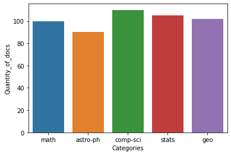
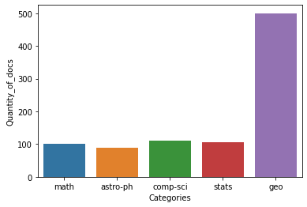

# Machine learning home test
#### ESDC Chief Data Office, Data Science Division

### Suggestion for the time allocated to do the homework: 
180 minutes divided between the coding section (1) and the essay sections (1.1 and 2).

## 1. ML problem (in Python)

You are a data scientist hired by ArXiv. They ask you to develop a pipeline that will 
automatically assign the right category for each new submitted article. The dataset consists of approximately 7,500 labelled abstracts of scientific articles.

The repository is structured as follows:
- `assignment_devoir/`
  - `assignmend.md`/ `devoir.md`
    - A document with the instructions (in both official languages)
- `dataset/`
  - `abstract_arxiv.csv`
    - Data consists of three columns: Id, Abstract and Category. If by any chance you have
      previous experience with this dataset, this one is a modified version of it.
- `scripts/`
  - `dataset.py`
    - Complete the `Dataset` class by following the TODOs.
  - `model.py`
    - Complete the `Model` class by following the TODOs.
  - `main_loop.py`
    - Code the necessary operations for a completed pipeline. You will
      have to use the `Dataset` and `Model` class that you've created. Train a Multinomial Naïve Bayes
      (provided by `scikit-learn`). Generate predictions of a given split and use the `Results` class to produce the 
      accuracy, the classification report and show a heatmap of the confusion matrix.
    - The objective here is **not** to make tweaks to improve the accuracy over and over... we just want to see how you approach the complete problem.
    - You are not allowed to install any packages other than the ones we stored in the `requirements.txt` file. 
      Of course, you are allowed to import any package from the standard Python library.
- `utils/`
  - `utils.py`
    - Nothing to do here. This is code that you are given and you will have to use some of it. Feel free to add 
      your own functions there if you want to.
  - `stopwords.txt`
    - Feel free to use it, just a regular stopwords list.

Before executing anything, you should install the necessary packages. The file requirements.txt contains the suggested packages for this assignment. Just go in the terminal, locate the repository of the project and execute this line:

<code>pip install -r requirements.txt</code>

If this does not work for you, one can manually install them:

- <code>pip install nltk</code> (and so on for `numpy`, `pandas`, `sklearn`, `matplotlib` and `seaborn`)

## 1.1 Analysis 

Describe your solution to the problem presented above by answering the following queries.

### Data

- Describe your data exploration.
- Pre-processing data can make a difference. Justify each pre-processing step that you implemented.
- Without modifying or re-running your code, tell us what would be the impact in terms of computation and model behavior if you were to train a model without the
  pre-processing that you implemented? Why?

### Distribution

Here is a histogram for a made-up training dataset.

Let's say that the training dataset has a different distribution (following image): 
  - What problem(s) would arise from such a distribution?
  - What can be done to solve it ?

### Results

In the coding section, we ask of you to show some results. One of the component of the `Results` class allows you to show a heatmap of a confusion matrix.

- What do you observe on the top-left corner of the heatmap concerning the categories that are called astro-ph* 
  (astro-ph, astro-ph.CO, astro-ph.GA, astro-ph.SR)? Looking at the precision and recall of the astro-ph* categories in the classification report, you will also observe this phenomenon.
- Why does this happen? Can you think of a solution to this problem?

### Comparison with other ML models

If we were to replace the classifier in the coding part (section 1.) with a K-Nearest Neighbor (KNN) model,
we might obtain an accuracy of approximately 25-30% (even with the optimal value of K). 
  - Why is KNN less suited than the Multinomial Naïve Bayes for this problem?

## 2. Government Use-case

In Canada, the employment insurance (EI) program is responsible for providing temporary income support to 
unemployed workers. Whenever an employee separates from their employer, the employer must fill out a
“Record of Employment” (ROE) form. 1 million Canadian employers file over 8 million ROE forms for their
employees each year. 

Suppose you are a data scientist whose task is to improve the efficiency of the EI program. Your task is to develop
a pipeline that will categorize comments on ROE forms into different "reasons for separation" (RFS) in order 
to facilitate the work of the EI program agents. There are currently no categories defined for classification, so you 
must establish appropriate ones. 
  - Give a detailed description of how such a system would be implemented and how you would evaluate its success.

## 3. Deliverables :

- Your implementation of `dataset.py`, `main_loop.py` and `model.py` completed.
- Your answers to the essay questions of the homework.
